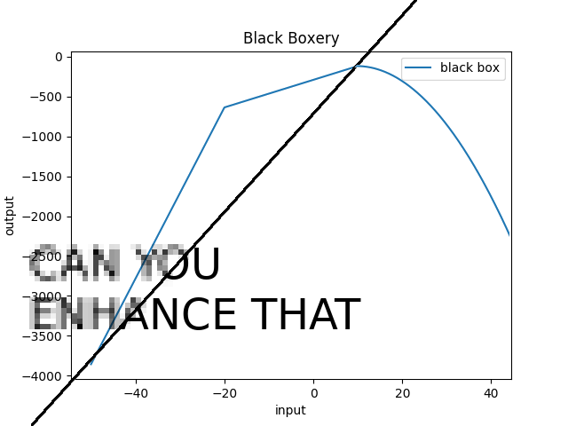

#TL;DR: y=-xx+1.5332x+5.80058
AKA "So Long, and Thanks for All the CPU Time".

The first thing I did was writing a convinience class that allowed me to get values from the black box using a `__getitem__` API. Then I just plot the values from the black box, which turned out to be a regular binominal. 

A binominal has a general formula of `y=a(x-x1)(x-x2)`, where x1 and x2 are the
roots. So, on the plot, I just zoomed in and enhanced until I got relatively precise values.

In retrospect, I should really have used the [bisection method](https://en.wikipedia.org/wiki/Bisection_method) here, but this looks more interesting to the eye, so I'm keeping it as-is.
The roots I got are `-1.7609` and `3.2941`, and the values are going to negative infinity as opposed to positive infinity, so the binominal for the black box is `y=-1(x+1.7609)(x-3.2941)=-xx+1.5332x+5.80058`.
